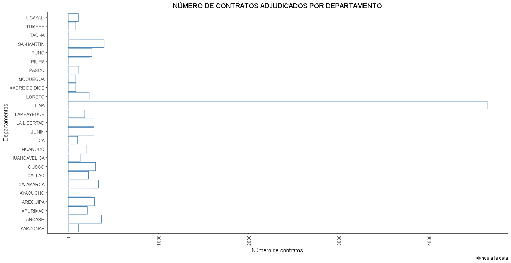

<!-- README.md is generated from README.Rmd. Please edit that file -->
=============================================================================

El objetivo de opencontracts es brindar funciones para analizar los contratos directos por Covid en Perú. El paquete nos permitirá analizar de forma rápida la situación de los contratos por emergencia durante el periodo de emergencia por el Covid-19. .Puedes aprender a utilizarlo a través de `vignette("opencontracts")`.

Instalacion
-----------

### Instalacion 

Para instalar debemos seguir los siguientes pasos:

    #Previamente tenemos que instalar devtools.
    install.packages("devtools")
    #Ahora instalamos el paquete desde GitHub
    devtools::install_github("manosaladata/contrataciones-estado-emergencia")

USO DEL PAQUETE
----------------------

### USO

Podemos usar el paquete con `library()`

    library(opencontracts)

Los comandos de utilidad son los siguientes:

    #El comando "data" nos permitirá acceder a las tablas y gráficas guardadas por defecto en el paquete.
    #data120 nos permitirá acceder al top de los 120 contratistas de acuerdo al monto 
    data('data120')
    #datatotal nos permitirá acceder al total de datos proveídos públicamente por el OSCE
    data('datatotal')
    #tabla120 nos permitirá acceder a un datatable delos 120 primeros contratistas de acuerdo al monto
    data('tabla120')
    #departamentos nos permitirá acceder a un gráfico del número de contratos por departamento
    data('departamento')
    
    

    

Codigo de conducta
------------------

